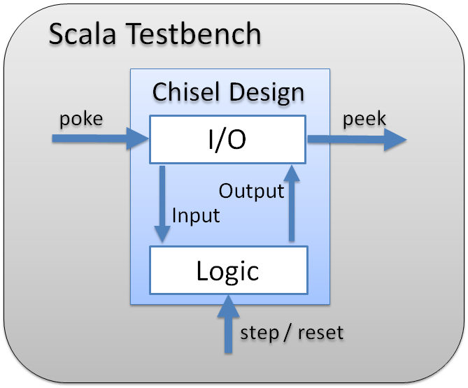

# Chisel HW Designs

The Chisel Designs in this repository were created while learning and evaluating the Hardware description language Chisel,
more specifically Chisel3, for the bachelor thesis. They prove to impart a general understanding of the circuit design
with Chisel.

## General Information
Designs can be found in /main

The corresponding Testbenches can be found in /test

The Testbenches are a mix of Scala and Chisel. Their purpose is the validation of a Chisel Design (module)
Therefore, the Testbench can set input signals (poke), control the clock (step & reset) and retrieve output
signals (peek)

	

